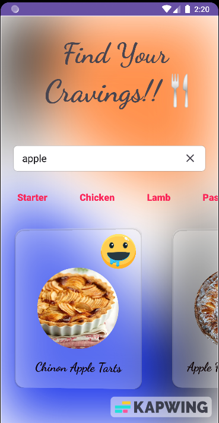

# FoodieHub

	

## Description

**FoodHub**🔥, A simple Food App where you can explore and find your craving foods details and recipes. It follows MVVM model architecture and build with Android Studio 📱💻, a mobile application for day to day cravings. Roll up and peep this dope app that's got your back when it comes to satisfying your hunger, homie. Let's get those taste buds fired up! 🤤👊

 

## Screenshots 

* HomeScreen

* Dashboard

* Info_dash

 

Home Screen

	

Dashboard

	

SearchByName

	

 

## Used technologies

- Co-routines

- LiveData

- ViewModel

- Navigation-Fragments

- Recyclerview

- Retrofit

- Glide 

- CircleImageView

- OKHTTP3 Log Interceptor
